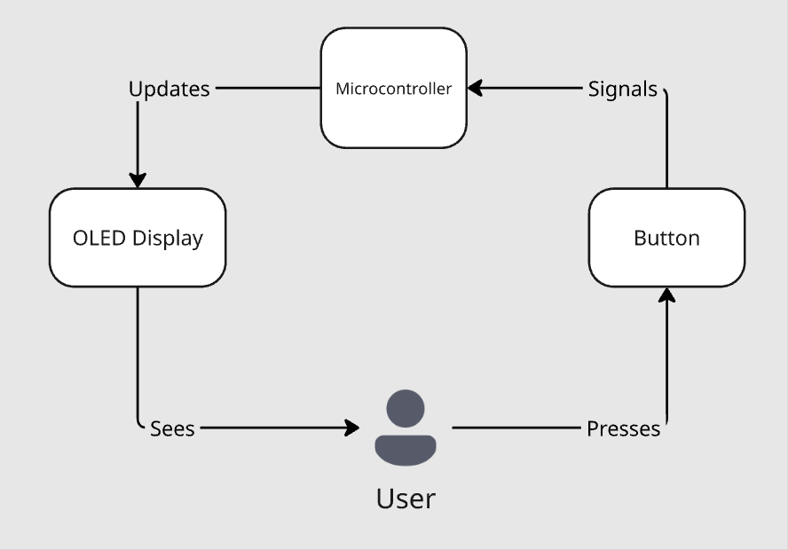
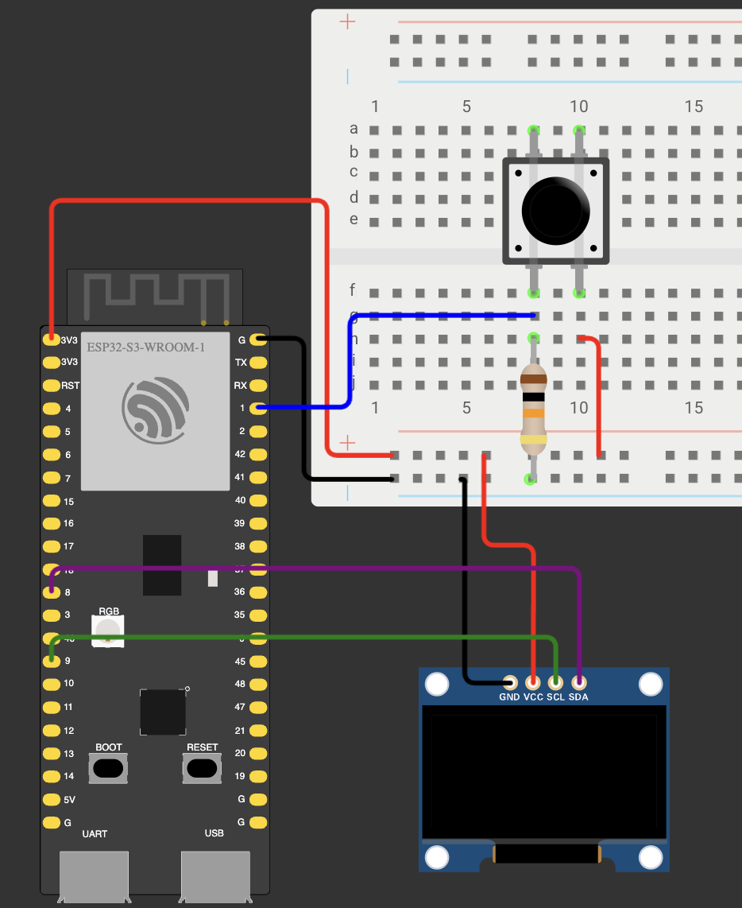
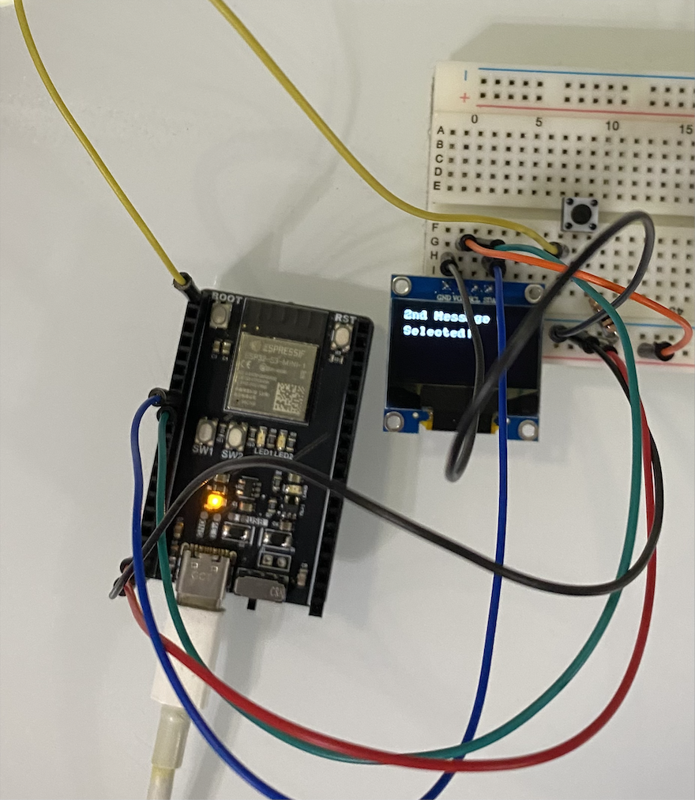

## Introduction

This tutorial will guide readers through the process of using a button to cycle through a list of predefined messages displayed on an OLED screen.
The motivation for this tutorial comes from our team's final project: a communication device designed for hikers in remote areas. Since users won’t have access to traditional messaging services, our device allows them to send and receive predefined messages. A key feature is enabling users to navigate through the available messages and select one to send.
By the end of this tutorial, readers will understand how to display messages on an OLED screen and use a button to implement basic navigation through that list of messages.

### Learning Objectives

- Read input from GPIO pins on the ESP32
- Handle button input to trigger events
- Use the `millis()` function in Arduino to manage timing without delay
- Control and update an OLED display to show dynamic content


### Background Information

In this tutorial, we will discuss how to use a button as an input device to control the behavior of an OLED display connected to an ESP32 microcontroller. We will look at how button presses can trigger different actions depending on how long the button is held down. This technique is used for expanding functionality without adding more input devices. 
We will also introduce the U8g2 graphics library to display text on the OLED screen.
Buttons are a simple and cost-effective way to interact with a microcontroller, making them ideal for devices with minimal interfaces. OLED displays are compact and capable of showing text which makes them perfect for projects like message-based communication devices.
Other input methods such as capacitive touch sensors could be used but increase cost. 
Understanding how to read button input using GPIO pins, manage timing with `millis()`, and interface with the OLED display using a graphics library is essential for building user interfaces on embedded systems like the ESP32. 


Describe your topic here. What does it do? Why do you use it?
Are there other similar things to use? What are the pros and cons?
Explain important concepts that are necessary to understand.
Include (and cite if needed) any visuals that will help the audience understand.

## Getting Started

We will be using the **Arduino IDE** to program the ESP32. 
Within the Arduino IDE you will need to install the **U8g2 library** through the Library Manager. This graphics library provides functions that make it easy to display text and graphics on an OLED screen.

In terms of hardware, this tutorial uses the **ESP32-S3-MINI-1** and relies on its **default I2C pins:**

- **GPIO 8** for SDA
- **GPIO 9** for SCL

Note that this tutorial does not cover how to configure custom I2C pins. If you are using a different microcontroller, you will need to look up its default I2C pins in order to follow along. A quick Google search using your microcontroller's name followed by “default I2C pins” should help you find the correct information.

### Required Downloads and Installations

The Arduino IDE can be downloaded [here](https://www.arduino.cc/en/software/).

After downloading the Arduino IDE, use its Library Manager to search for and install the U8g2 library. You can find detailed steps with pictures [here](https://github.com/olikraus/u8g2/wiki/u8g2install). 

### Required Components

List your required hardware components and the quantities here.

| Component Name | Quanitity |
| -------------- | --------- |
| ESP32          | 1         |
| OLED Display (128x64)| 1   |
| Button         | 1         |
| Resistor (10kΩ)| 1         |
| Breadboard     | 1         |

### Required Tools and Equipment

Computer, Arduino IDE

## Part 01: Setting up the Circuit

### Introduction

In this section, we will focus on setting up the hardware for the project. You’ll learn how to connect the button and OLED display to the ESP32. We will explain why a resistor is needed with the button. No code will be written in this section.

### Objective

- Understand how to connect the button, OLED display, and ESP32.
- Understand why the resistor is used with the button.

### Background Information

Although the push button typically has four pins, they are internally connected in pairs, meaning the button has two terminals. One terminal will be connected directly to the 3.3V rail, while the other will be connected to ground through a pull-down resistor. The GPIO pin will be connected to the same side as the resitor that is connected to ground.

When the button is **not pressed**, the terminals are disconnected, and the GPIO pin will read LOW because it's pulled down to ground through the resistor. When the button is **pressed**, the terminals are connected, allowing current to flow through from the 3.3V rail to the GPIO pin, which will then read HIGH. 

The resistor is essential because, without it, pressing the button would directly short 3.3V to ground. In addition, when the button is unpressed and the resistor is left out, the GPIO pin can float, leading to unreliable or noisy readings.

The OLED display has four pins: GND, VCC, SCL, and SDA. GND should be connected to the ground rail, VCC to the 3.3V rail, and SCL and SDA to the default I2C pins on the ESP32. 

### Components

- Breadboard
- ESP32
- Button
- Resistor (10kΩ)
- OLED Display
- Jumper Cables

### Instructional

Assemble the circuit as shown in the image below.



## Part 02: Writing the Code

### Introduction

In this section, we will go over the code used to handle button input and display text on the OLED screen. You'll learn how to use the `millis()` function to measure how long the button is pressed and trigger different actions based on the duration of the press. 

### Objective

- Understand how to assign pin numbers in Arduino
- Understand how to implement functions in Arduino
- Understand how to use the U8g2 library to display text on the OLED screen

### Background Information

Explain how the example used your tutorial topic. Give in-depth analysis of each part and show your understanding of the tutorial topic


### Components

- ESP32
- USB-C to USB-C Connector cable for ESP32
- Your Computer

### Instructional
Let’s begin by setting up the OLED display and defining the pins and constants needed for the button. Open up a new sketch in the Arduino IDE.

```C++
#include "U8x8lib.h" 

U8X8_SSD1306_128X64_NONAME_HW_I2C oled(U8X8_PIN_NONE);
```

Include the U8x8lib.h library. Then instantiate the display object and reset it using the predefined argument "U8X8_PIN_NONE" since we don't have a reset pin on our OLED screen.

```C++
void displayMessage(const char* message, int row, bool erase){
  if(erase){
    oled.clearDisplay();
  }
  oled.setCursor(0, row);
  oled.print(message);
}
```

Create a function that will be used to write a message on the OLED display. 
- `message` is the message that will be displayed on the screen. Its length must be less than 17 characters to be displayed properly because our screen can only fit up to 16 characters per row.
- `row` specifies which row to print on: [0,1,2,3,4,5,6,7].
- `erase` specifies whether the display should be cleared before displaying message
- `clearDisplay()` clears all pixels on the screen.
- `setCursor(x,y)` defines the cursor for the print function. Any output of the print function will start at this position. x and y are the column/row position for cursor.
- `print()` will write the text to the current cursor position with the current font.


```C++
const int BTN_PIN = 1;
unsigned long pressTime = 0;
int btnState = 0;
int prevBtnState = 0;

constexpr int NUM_OF_MESSAGES = 3;
constexpr int MAX_LENGTH = 17; 
char messages[NUM_OF_MESSAGES][MAX_LENGTH] = {"1st Message", "2nd Message", "3rd Message"};
int selected = 0;   
```

- `BTN_PIN` is the GPIO pin connected to the button
- `pressTime` will be used to keep track of when the button is pressed down
- `btnState` and `prevBtnState` will store the current and previous state of the button
- `NUM_OF_MESSAGES` is the number of prefined messages that we will have
- `MAX_LENGTH` is the maximum length of each message. 16 characters per row +1 for the null terminator
- `messages` is a 2-D char array that stores the predefined messages
- `selected` will be used to keep track of the message that is currently selected


```C++
void setup() {
  oled.begin(); 
  oled.setFont(u8x8_font_amstrad_cpc_extended_r);
  oled.setCursor(0, 0);

  pinMode(BTN_PIN, INPUT);
  displayMessage(messages[selected], 0, true);
}
```
- `begin()` initializes the u8x8 object and will reset, configure, clear and disable power save mode of the display.
- `setFont()` defines a u8x8 font for the glyph and string drawing functions.
- `setCursor(0, 0)` sets the cursor at the top left corner.
- `pinMode(BTN_PIN, INPUT)` configures the button pin as input to read the state of the button.
- `displayMessage()` is used here to display the first message on the screen.

```C++
void loop() {
  btnState = digitalRead(BTN_PIN);

  //check for button press
  if(LOW == prevBtnState and HIGH == btnState){
    pressTime = millis(); //record the time when the button is first pressed
  }

  //check for button release
  if(HIGH == prevBtnState and LOW == btnState){
    //if button was held down for 2 seconds or more, display confirmation message
    if(millis() - pressTime >= 2000){ 
      displayMessage("Selected!", 2, false);
      selected = -1;  //reset to -1 so next press increments to 0 (first message)
    } else if(selected == NUM_OF_MESSAGES-1) { //if at last message, loop back to 1st
      selected = 0;
      displayMessage(messages[selected], 0, true);
    } else { //go to next message
      selected++;
      displayMessage(messages[selected], 0, true);
    }

  }
  //save current button state for next loop iteration
  prevBtnState = btnState;
}
```

- The loop continuosly monitors the state of the button and updates the display accordingly.
- `digitalRead(BTN_PIN)` reads the current state of the button(HIGH or LOW)
- The first `if` statement detects when the button is initially pressed and records the time using`millis()`.
- The second `if` statement detects when the button is released. 
  - If the button was held down for 2 seconds or more, it displays "Selected!" on the second row and resets the selected index to -1 to prepare for the next cycle. 
  - If the button was released before 2 seconds, it checks if the current message is the last one. If so, it wraps back to the first message. Otherwise it increments to the next message.
- Lastly, we store the current button state as the previous state to save the state for the next iteration

## Final Circuit Image



## Additional Resources

### Useful links

List any sources you used, documentation, helpful examples, similar projects etc.

[U8x8 Reference](https://github.com/olikraus/u8g2/wiki/u8x8reference#setfont)

[U8x8 Setup](https://github.com/olikraus/u8g2/wiki/u8x8setupcpp)
